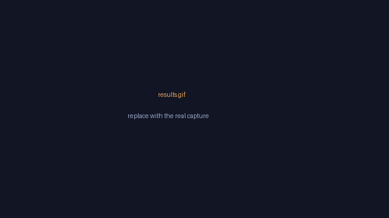
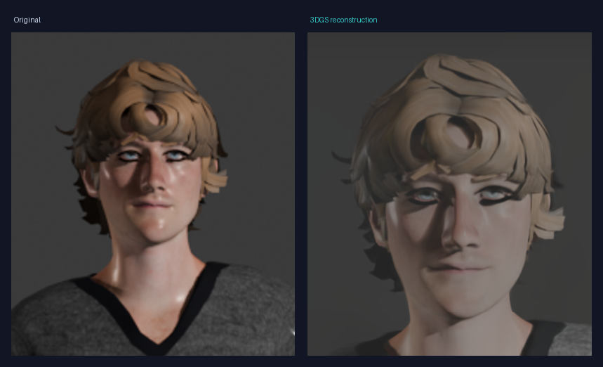
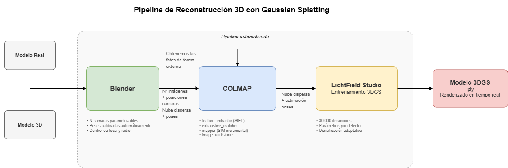

<!-- Idioma: Español | [English](README.md) -->

# Foto → 3D · Pipeline de Gaussian Splatting

**Convierte un puñado de fotos en un modelo 3D que puedes explorar en tiempo real.** Un solo comando toma un `.zip` de imágenes y ejecuta todo el proceso — estimación de poses de cámara con COLMAP y entrenamiento de 3D Gaussian Splatting con LichtFeld Studio — y te devuelve un `.ply` que puedes abrir en cualquier visor de Gaussian Splatting.

> Desarrollado como mi Trabajo de Fin de Grado (Ingeniería Informática, Universidad de Alicante). Por el camino hice un estudio sistemático sobre **qué hace realmente que una reconstrucción salga bien** — y la respuesta no fue la que esperaba. Ver [El hallazgo](#-el-hallazgo).

<p align="center">
  
  <br><em>⚠️ placeholder — sustituye <code>assets/results.gif</code> por la captura real</em>
</p>

<p align="center">
  
  <br><em>Izquierda: original. Derecha: reconstrucción 3DGS.</em>
</p>


---

## ✨ Qué hace

```bash
python reconstruct.py mis_fotos.zip
```

```
mis_fotos.zip  ──▶  COLMAP  ──▶  LichtFeld Studio  ──▶  model.ply
   (fotos)          (poses +        (3D Gaussian         (modelo 3D
                   nube dispersa)    Splatting)          en tiempo real)
```

- **Un único punto de entrada.** Entra un `.zip` (o carpeta) de fotos, sale un `model.ply`.
- **Totalmente automatizado**, sin pasos manuales entre etapas.
- **Cero dependencias de Python** — el orquestador usa solo la librería estándar.
- También se ejecuta con **doble clic** en `reconstruct.bat` (Windows) o arrastrándole un zip encima.



---

## 🔍 El hallazgo

El TFG estudió cómo afectan las decisiones de captura a la calidad, usando imágenes sintéticas como **laboratorio controlado** (poses de cámara exactas, todas las variables bajo control). Dos resultados destacan:

1. **Más cámaras no siempre es mejor.** 80 cámaras registran una tasa *menor* (80,0 %) que 60 cámaras (86,7 %) — la distribución geométrica de las vistas importa tanto como su número.
2. **El encuadre gana al número de cámaras.** Asegurar que el objeto entero está en cuadro (gran angular, más distancia) llevó el registro de COLMAP al **100 %** *sin añadir una sola cámara ni coste adicional*.

Desarrollo completo en el [TFG](#-tfg).

---

## 🧰 Requisitos

| Herramienta | Para qué | Enlace |
|---|---|---|
| **Python 3.9+** | ejecuta el orquestador | [python.org](https://www.python.org/) |
| **COLMAP** (build CUDA) | poses de cámara + nube dispersa | [colmap.github.io](https://colmap.github.io/) |
| **LichtFeld Studio** | entrenamiento 3D Gaussian Splatting | [github.com/MrNeRF/LichtFeld-Studio](https://github.com/MrNeRF/LichtFeld-Studio) |
| **GPU NVIDIA** (CUDA) | la necesitan COLMAP-CUDA y el 3DGS | — |

> Probado en una NVIDIA RTX 4060 Laptop (8 GB). El cap por defecto de 500 000 gaussianas mantiene el entrenamiento dentro de los 8 GB de VRAM.

---

## 🚀 Instalación

```bash
git clone https://github.com/emr81-ua/3d-gaussian-splatting-reconstruction.git
cd 3d-gaussian-splatting-reconstruction
```

Después indícale al script dónde están COLMAP y LichtFeld Studio de **cualquiera** de estas formas:

- añádelos al `PATH`, o
- define las variables de entorno `COLMAP_EXE` y `LICHTFELD_EXE`, o
- ponlos en una carpeta local `tools/`, o
- pásalos con `--colmap-exe` / `--lichtfeld-exe`.

---

## ▶️ Uso

```bash
# desde un zip de fotos
python reconstruct.py mis_fotos.zip --iter 15000

# desde una carpeta de fotos
python reconstruct.py ruta/a/fotos/ --iter 15000

# vista previa rápida (menos iteraciones)
python reconstruct.py mis_fotos.zip --iter 2000

# solo COLMAP (nube dispersa, sin entrenar)
python reconstruct.py mis_fotos.zip --skip-training
```

| Opción | Descripción |
|---|---|
| `--iter N` | iteraciones de entrenamiento (más = mejor, más lento). Por defecto `15000` |
| `--max-gaussians N` | tope de gaussianas. Bájalo si te quedas sin VRAM. Por defecto `500000` |
| `--output DIR` | carpeta de salida (por defecto `output/<nombre>`) |
| `--skip-training` | solo COLMAP |
| `--colmap-exe` / `--lichtfeld-exe` | rutas explícitas a las herramientas |

La **salida** queda en `output/<nombre>/`:
- `model.ply` — el modelo 3D Gaussian Splatting final
- `dense/` — la reconstrucción de COLMAP
- `images/` — las fotos de entrada

**Visualiza el resultado** con cualquier visor de Gaussian Splatting, p. ej. LichtFeld Studio:
```bash
LichtFeld-Studio --view output/mis_fotos/model.ply
```

---

## 📸 Consejos para buenas fotos

- **30–60 fotos** dando toda la vuelta al objeto, con **solape** entre fotos consecutivas.
- Objeto **quieto**, luz uniforme y fondo con algo de textura.
- Evita fotos movidas y superficies totalmente lisas o reflectantes.

Hay un ejemplo pequeño en [`examples/`](examples/) para probar el pipeline al momento.

---

## ⚙️ Cómo funciona

| Etapa | Herramienta | Qué ocurre |
|---|---|---|
| 1. Poses | **COLMAP** | características SIFT → emparejamiento → Structure-from-Motion → nube dispersa, undistort al formato 3DGS |
| 2. Entrenamiento | **LichtFeld Studio** | entrena un modelo 3D Gaussian Splatting sobre las imágenes con pose |
| 3. Salida | — | el último splat se copia a `model.ply` |

Los parámetros de COLMAP están ajustados para imágenes de baja textura / sintéticas (menor `peak_threshold` de SIFT, umbrales del mapper relajados) y funcionan bien también con fotos reales.

---

## 🔬 Scripts de investigación

La carpeta [`research/`](research/) contiene los scripts usados en los experimentos del TFG — generación procedural de cámaras en Blender, ejecuciones por lotes de COLMAP/LichtFeld y el código de evaluación. Se incluyen tal cual, por transparencia; algunas rutas pueden necesitar ajuste a tu máquina.

---

## 📄 TFG

*Reconstrucción realista de modelos 3D utilizando Gaussian Splatting* — Eric Muñoz Rouillion, Universidad de Alicante, 2026. *(enlace a la memoria / PDF aquí)*

---

## 🙏 Agradecimientos

- [COLMAP](https://colmap.github.io/) — Schönberger & Frahm
- [LichtFeld Studio](https://github.com/MrNeRF/LichtFeld-Studio) — entrenamiento 3D Gaussian Splatting
- [3D Gaussian Splatting](https://repo-sam.inria.fr/fungraph/3d-gaussian-splatting/) — Kerbl et al.

## 📜 Licencia

[MIT](LICENSE) © 2026 Eric Muñoz Rouillion
